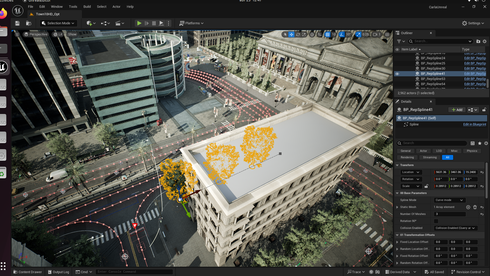

Esta semana instalé CARLA localmente utilizando Ubuntu 22.04 y la última versión disponible. Para complementar el proceso de instalación y comprender mejor el entorno, revisé los siguientes artículos académicos:

* [https://doi.org/10.1109/LRA.2023.3336244](https://doi.org/10.1109/LRA.2023.3336244)
* [https://doi.org/10.1016/j.neucom.2024.127874](https://doi.org/10.1016/j.neucom.2024.127874)
* [https://doi.org/10.1016/j.neucom.2024.128161](https://doi.org/10.1016/j.neucom.2024.128161)

