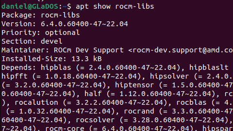
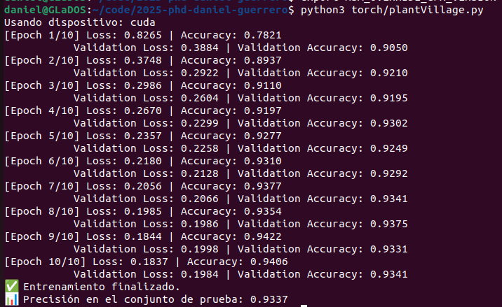

# Entrenamiento de Red Neuronal con PyTorch y ROCm en GPU AMD

Durante esta semana realicé la instalación de ROCm en Ubuntu con el objetivo de poder utilizar la tarjeta gráfica AMD que tengo, una **AMD Radeon RX 6750 XT**. El entorno fue configurado correctamente para aprovechar el backend de ROCm en PyTorch.

## Instalación de ROCm

La instalación se llevó a cabo en Ubuntu, asegurándome de que el sistema fuera compatible con ROCm y que la GPU estuviera soportada (aunque requiere un ajuste adicional para `gfx1031`).

A continuación, incluiré una imagen que muestra el entorno configurado tras la instalación de ROCm.

## Dataset de PlantVillage

Descargué el dataset de PlantVillage para realizar un experimento de clasificación de imágenes de hojas con enfermedades. Utilicé `ImageFolder` de `torchvision.datasets` para cargar las imágenes y apliqué transformaciones estándar como `Resize`, `ToTensor`, y `Normalize`.

## Entrenamiento con PyTorch + ROCm

Entrené un modelo `ResNet18` utilizando PyTorch 2.7.0 con backend ROCm 6.3. Durante el entrenamiento, se utilizó la GPU correctamente a través del dispositivo `hip`.

También incluiré una imagen del proceso de entrenamiento ejecutándose en la GPU AMD con ROCm.

El modelo fue entrenado durante 10 épocas y se guardó como `modelo_plantvillage_rocm.pth`. Se utilizó un 80% del conjunto para entrenamiento, 10% para validación y 10% para prueba.

---

