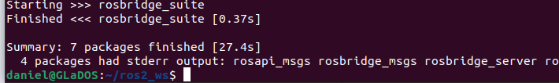
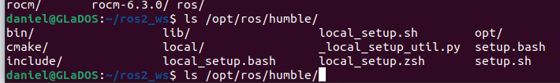

# Avances en la Integración de ROS 2 y CARLA

Tras configurar mi nuevo sistema, confirmé la ausencia de ROS, procediendo a la instalación exitosa de **ROS 2 Humble**.

Mi interés en la conducción autónoma off-road me llevó a estudiar el artículo "**Cross-Dataset Evaluation of Visual Semantic Segmentation Models for Off-Road Autonomous Driving**", resaltando la importancia de la segmentación visual en entornos no estructurados.

Para explorar la conexión entre ROS 2 y el simulador CARLA, instalé **rosbridge**. Sin embargo, mis intentos iniciales de interactuar con el entorno virtual de CARLA, específicamente al intentar mover objetos, no tuvieron éxito.

Ante esta dificultad en la implementación de código con CARLA, contacté a David para solicitar una reunión de asesoría durante esta semana. Considero que su guía inicial será crucial para avanzar en la integración de estos sistemas.ls
