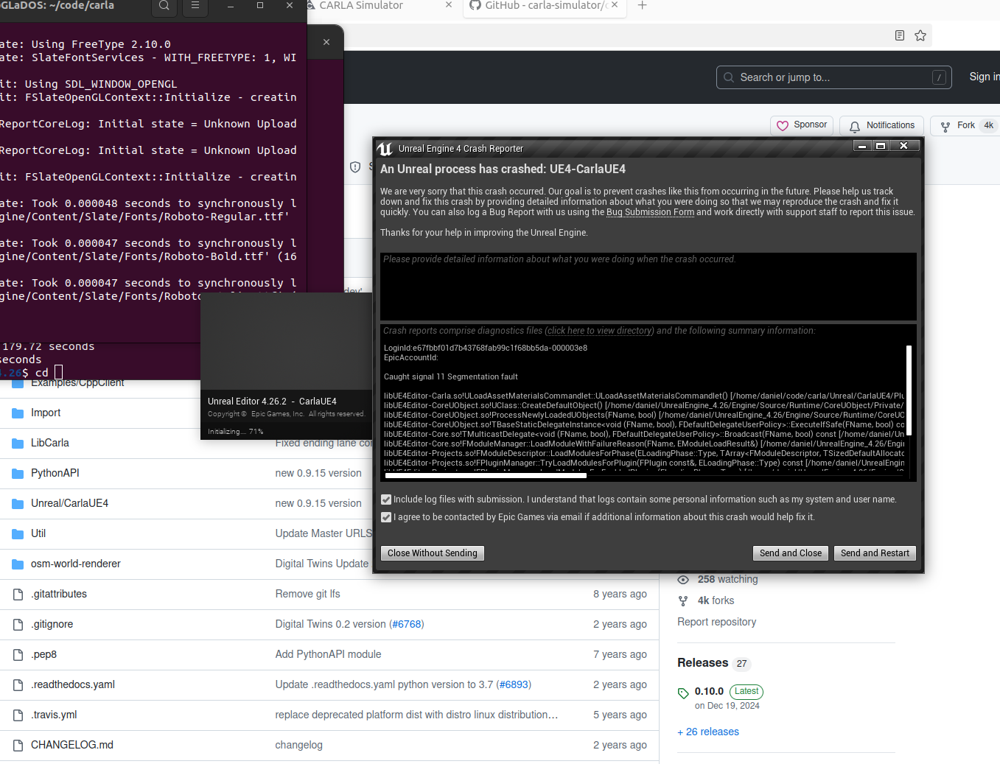

# Avances con la compilacion de Carla
Al principio de la semana hable con David sobre los siguientes pasos con Carla, me compartio varios archivos correspondientes 
los entornos forestales y me explico como compilar Carla con Unreal Engine 4.26.2
Desafortuanadamente no funciono el proceso hay un error correspondiente a la segmentación.

