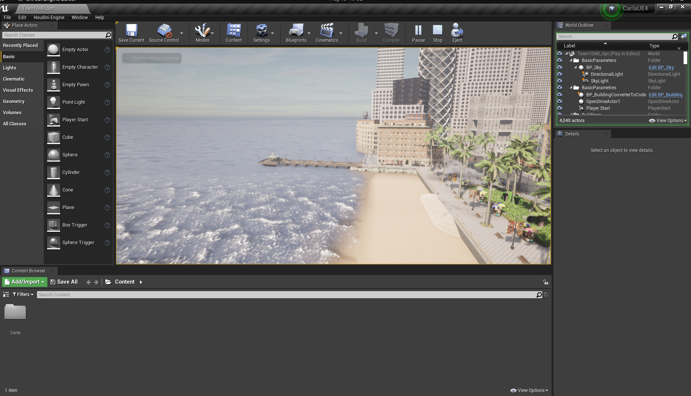
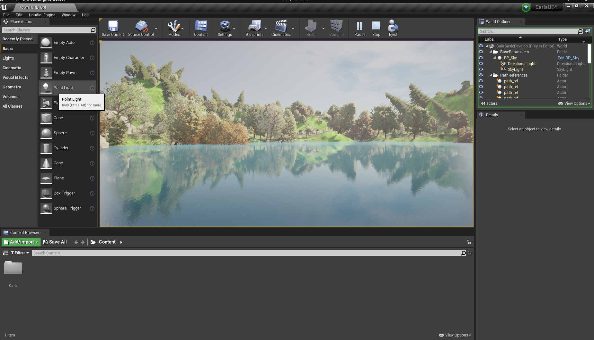
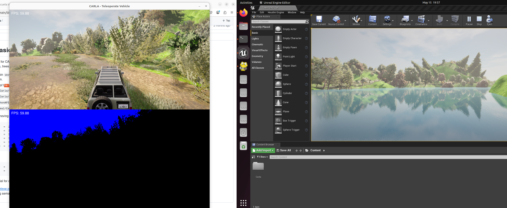

# Progreso Semanal con CARLA y GaiaBasicDevelop

Esta semana avancé en la configuración de mi entorno de simulación:

1.  **Resolución de Problemas de Compilación de CARLA:**
    Logré solucionar los problemas que tenía con la compilación de CARLA. Ahora, la plataforma corre de manera exitosa.
    

2.  **Integración del Repositorio GaiaBasicDevelop:**
    Después de solucionar la compilación de CARLA, añadí el repositorio de GaiaBasicDevelop. Pude ejecutar la simulación exitosamente.
    

3.  **Ejecución del Ejemplo de Teleoperación:**
    Finalmente, dentro de la simulación, ejecuté el código de ejemplo de teleoperación, el cual también funcionó correctamente.
    

4.  **Revisión del Código de David:**
    Después de estos avances, revisé el código de David, el cual estoy próximo a intentar implementar.