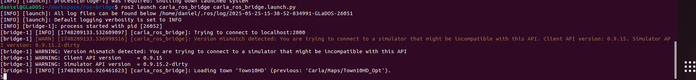
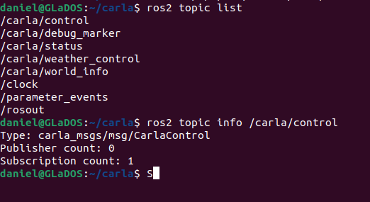
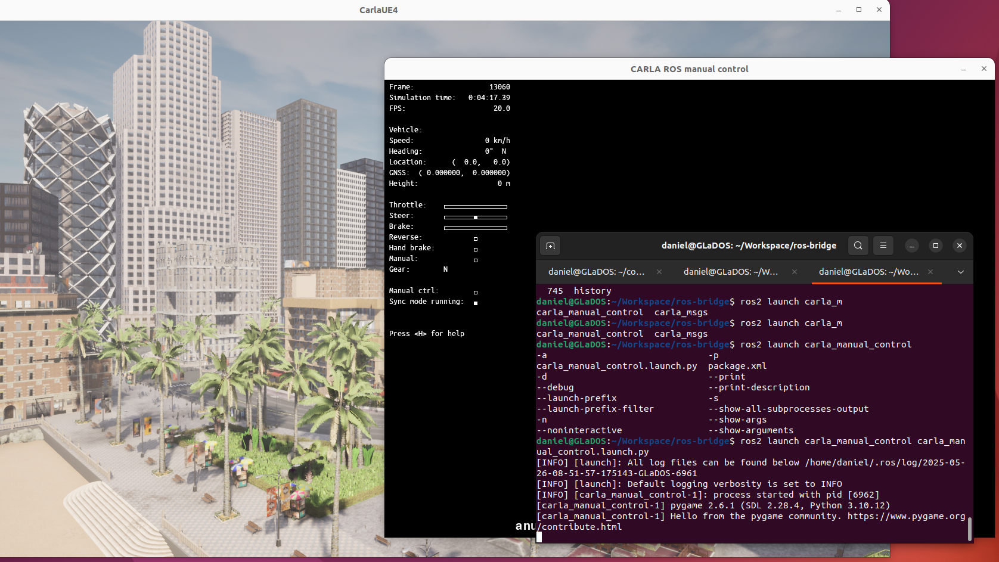

# Progreso Semanal con CARLA y GaiaBasicDevelop

Esta semana avancé en la configuración de ROS2 Bridge para Carla.

1.  **Logre usar una version de ros-bridge modificada para funcioanr con Carla 0.9.15:**
    Despues de multiples problemas con la version oficial logre hacer que compilara una version modificada
    y que funcionara con mi version de linux.
    
    

2.  **Implementacion del manual control con ROS2**
    Logre correr el nodo de manual control integrado con carla pero necesito adquirir la imagen para tener
    una respuesta de que este esta funcionando correctamente.
    
